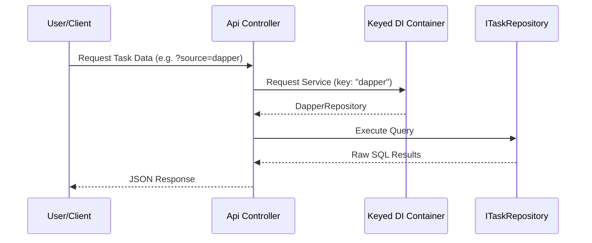
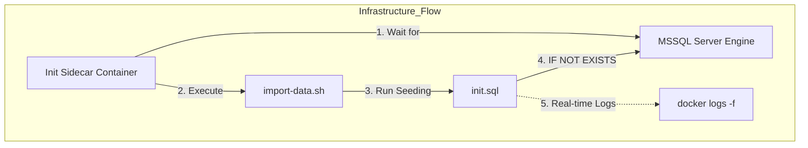

# 🚀 Devs Ecosystem
> A curated collection of modular software projects, architectural studies, and infrastructure-as-code implementations.

---

## 📋 Table of Contents

1. [🌱 Evolutionary Path](#1-🌱-evolutionary-path)
2. [📂 Ecosystem Tiers](#2-📂-ecosystem-tiers)
    - [2.1 👶 Junior Level](#21-👶-junior-level)
    - [2.2 ⚙️ Mid-level Tier](#22-⚙️-mid-level-tier)
    - [2.3 🧠 Senior Level](#23-🧠-senior-level)
3. [🚀 Quick Start](#3-🚀-quick-start)
4. [🌎 Global Resources](#4-🌎-global-resources)

---

## 1. 🌱 Evolutionary Path

This ecosystem is designed to guide developers through a structured growth journey:

| Tier | Focus Area | Core Technologies |
| :--- | :--- | :--- |
| **Junior** | Fundamentals & Simple Logic | Basic C#, Web Basics |
| **Mid-level** | Architecture & Patterns | EF Core, Dapper, SQL Server |
| **Senior** | Scalability & Distributed Systems | Microservices, K8s, Cloud |

---

## 2. 📂 Ecosystem Tiers

### 2.1 👶 Junior Level ([/junior](junior))
Entry-level projects focused on building a rock-solid foundation.
> *Upcoming: Fundamental algorithms and basic Web APIs.*

### 2.2 ⚙️ Mid-level Tier ([/mid-level](mid-level))
Advanced implementations focusing on modularity, decoupling, and high performance.

#### 2.2.1 🏆 TaskMaster API Challenge
> **The Problem**: Your team needs a Task Management system that can switch between heavy ORM (EF Core) and high-speed raw SQL (Dapper) without the API ever knowing the difference.

> **The Goal**: Implement Clean Architecture and Rich Domain Models while using Dependency Injection with Keyed Services to swap data access layers on the fly.
>
> 🔧 **Solution**: [TaskMaster API Solution](mid-level/task-master-api)

#### 2.2.2 🛠 MSSQL Docker Challenge
> **The Problem**: Manual database setup is a bottleneck. You need a "one-command" infrastructure that is persistent, idempotent, and fully automated.

> **The Goal**: Build a Docker Compose architecture with a sidecar initialization container, automated schema seeding (IF NOT EXISTS), secure `.env` management, and real-time TTY logs.
>
> 🐳 **Solution**: [MSSQL Docker Solution](mid-level/devs-ml-docker-compose-db)

### 2.3 🧠 Senior Level ([/senior](senior))
Expert-level implementations for high-scale, mission-critical environments.
> *Upcoming: Event-driven architectures and Microservices.*

---

## 3. 🚀 Quick Start (TaskMaster API)

1. **Infrastructure**: Copy `.env.example` to `.env` in `mid-level/devs-ml-docker-compose-db`, then run `docker-compose up -d`.
2. **Launch API**: Run `dotnet run` in `mid-level/task-master-api/src/TaskMaster.Api`.
3. **Explore**: Access the interactive Scalar UI at [localhost:5050/scalar/v1](http://localhost:5050/scalar/v1).

---

## 4. 🌎 Global Resources

- [Glossário Geral (PT)](mid-level/task-master-api/docs/GLOSSARIO_GERAL_PT.md) - Technical terms repository.
- [Glossário de Pacotes (PT)](mid-level/task-master-api/docs/PACKAGES_GERAL_PT.md) - Complete NuGet package inventory.
- [Project Flows (PT)](mid-level/task-master-api/docs/FLOWS_PT.md) - Architecture and data flow diagrams.

---

*For the Portuguese version of this document, see [README_pt.md](README_pt.md).*
