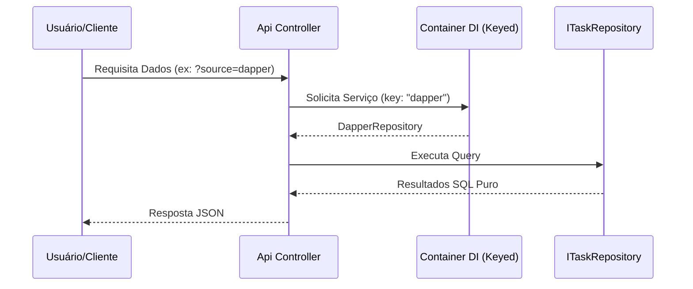
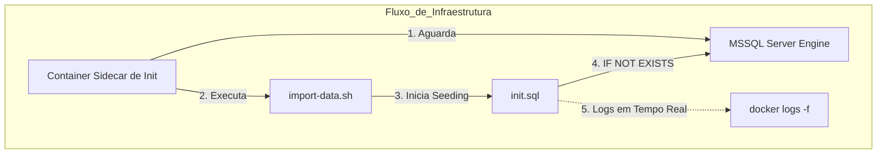

# 🚀 Ecossistema Devs
> Uma coleção curada de projetos modulares, estudos arquiteturais e implementações de infraestrutura como código.

---

## 📋 Índice

1. [🌱 Trilha Evolutiva](#1-🌱-trilha-evolutiva)
2. [📂 Níveis do Ecossistema](#2-📂-níveis-do-ecossistema)
    - [2.1 👶 Nível Junior](#21-👶-nível-junior)
    - [2.2 ⚙️ Nível Pleno](#22-⚙️-nível-pleno)
    - [2.3 🧠 Nível Sênior](#23-🧠-nível-sênior)
3. [🚀 Início Rápido](#3-🚀-início-rápido)
4. [🌎 Recursos Globais](#4-🌎-recursos-globais)

---

## 1. 🌱 Trilha Evolutiva

Este ecossistema foi desenhado para guiar desenvolvedores em uma jornada de crescimento estruturada:

| Nível | Foco de Estudo | Tecnologias Chave |
| :--- | :--- | :--- |
| **Junior** | Fundamentos e Lógica Simples | C# Básico, Web Fundamentals |
| **Pleno** | Arquitetura e Padrões | EF Core, Dapper, SQL Server |
| **Sênior** | Escalabilidade e Distribuídos | Microserviços, K8s, Cloud |

---

## 2. 📂 Níveis do Ecossistema

### 2.1 👶 Nível Junior ([/junior](junior))
Projetos de entrada focados em construir uma base técnica sólida.
> *Em breve: Algoritmos fundamentais e Web APIs básicas.*

### 2.2 ⚙️ Nível Pleno ([/mid-level](mid-level))
Implementações avançadas focadas em modularidade, desacoplamento e alta performance.

#### 2.2.1 🏆 Desafio TaskMaster API
> **O Problema**: Sua equipe precisa de um sistema de tarefas flexível o suficiente para alternar entre um ORM robusto (EF Core) e SQL puro de alta performance (Dapper) sem que a API perceba a diferença.

> **O Objetivo**: Implementar Clean Architecture e Modelos Ricos enquanto utiliza Injeção de Dependência com Keyed Services para trocar as camadas de acesso a dados dinamicamente.
>
> 🔧 **Solução**: [Solução TaskMaster API](mid-level/task-master-api)

#### 2.2.2 🛠 Desafio MSSQL Docker
> **O Problema**: A configuração manual do banco é um gargalo. Você precisa de uma infraestrutura "um-comando" que seja persistente, idempotente e totalmente automatizada.

> **O Objetivo**: Construir uma arquitetura Docker Compose com sidecar container de inicialização, seeding automático (IF NOT EXISTS), gestão segura de `.env` e logs TTY em tempo real.
>
> 🐳 **Solução**: [Solução MSSQL Docker](mid-level/devs-ml-docker-compose-db)

### 2.3 🧠 Nível Sênior ([/senior](senior))
Implementações de nível especialista para ambientes de alta escala e missão crítica.
> *Em breve: Arquiteturas orientadas a eventos e Microserviços.*

---

## 3. 🚀 Início Rápido (TaskMaster API)

1. **Infra**: Copie `.env.example` para `.env` em `mid-level/devs-ml-docker-compose-db` e execute `docker-compose up -d`.
2. **Launch API**: Execute `dotnet run` em `mid-level/task-master-api/src/TaskMaster.Api`.
3. **Explorar**: Acesse a interface interativa do Scalar em [localhost:5050/scalar/v1](http://localhost:5050/scalar/v1).

---

## 4. 🌎 Recursos Globais

- [Glossário Geral (PT)](mid-level/task-master-api/docs/GLOSSARIO_GERAL_PT.md) - Repositório de termos técnicos.
- [Glossário de Pacotes (PT)](mid-level/task-master-api/docs/PACKAGES_GERAL_PT.md) - Inventário completo de pacotes NuGet.
- [Fluxos do Projeto (PT)](mid-level/task-master-api/docs/FLOWS_PT.md) - Diagramas de arquitetura e fluxo de dados.

---

*Para a versão em inglês deste documento, veja [README.md](README.md).*
