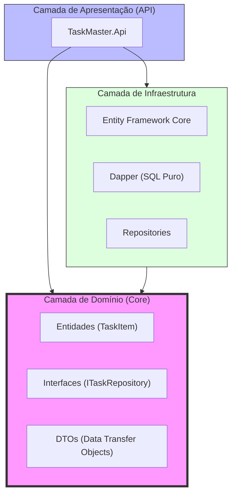
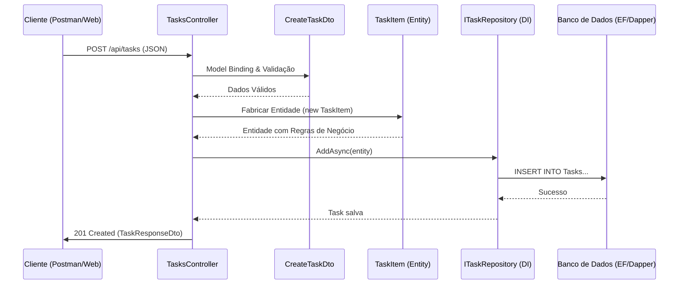
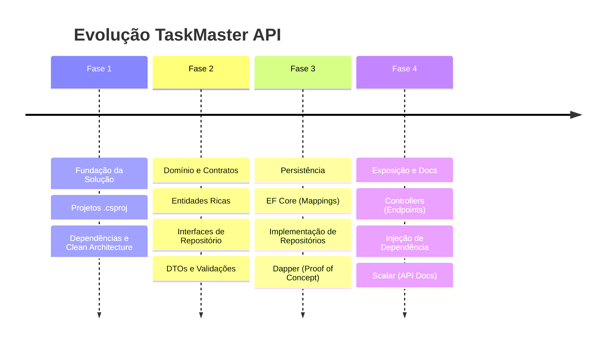
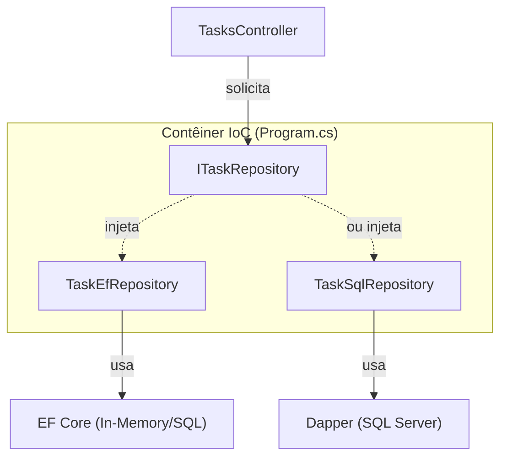

# 📊 Fluxos do Projeto - TaskMaster API

Este documento utiliza diagramas **Mermaid** para explicar visualmente a arquitetura, o fluxo de dados e a evolução do projeto.

---

## 1. Arquitetura de Camadas (Clean Architecture)

O projeto segue os princípios da Arquitetura Limpa, onde a dependência sempre aponta para o centro (Core).

---

## 2. Ciclo de Vida de uma Requisição (Request Flow)

O caminho que um dado percorre desde a chamada do cliente até o armazenamento no banco de dados.

---

## 3. Linha do Tempo de Desenvolvimento (Fases)

Evolução do projeto organizada por entregas incrementais.

---

## 4. Injeção de Dependência (DI) e Plugins

Nossa arquitetura permite trocar o "motor" de persistência sem alterar a lógica de negócio ou os controladores.

> [!TIP]
> Para entender os termos usados nestes fluxos, consulte o [Glossário Geral](GLOSSARIO_GERAL_PT.md).
